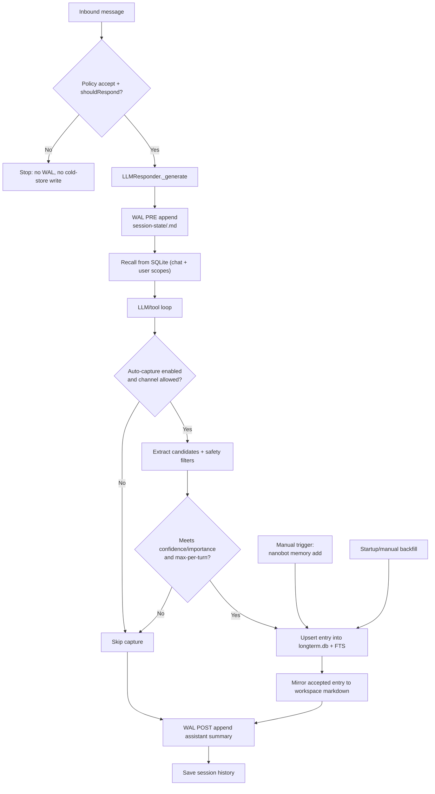

# Memory System (`nanobot`) - Architecture, Flow, and Operations

This document explains how nanobot long-term memory works end to end:
- flow per turn (when memory is read/written),
- where data is stored,
- how to inspect/query it,
- how to steer behavior with config.

## 1) What this system does

nanobot memory is a local-first long-term memory layer with:
- scoped recall (chat + user),
- heuristic auto-capture (default on),
- SQLite FTS retrieval (current backend),
- per-session WAL markdown state files,
- optional manual memory operations via CLI.

It is designed to avoid cross-chat leakage while still remembering user preferences across chats.

## 2) Runtime flow (per inbound event)

For each inbound message handled by the responder:

1. Session/route is resolved (`channel`, `chat_id`, `session_key`).
2. WAL pre-write is appended to `memory/session-state/<session>.md` before the LLM call.
3. Recall query is built from:
   - current user text,
   - optional `reply_to_text` (if present in metadata).
4. Retrieval runs in two layers:
   - chat scope: all memory kinds,
   - user scope: only `preference` + `fact`.
5. Hits are merged and ranked:
   - `final_score = 0.65 * fts_norm + 0.20 * importance + 0.15 * recency`
6. Retrieved memory is rendered into a bounded synthetic system message.
7. LLM/tool loop executes as usual.
8. Post-response auto-capture runs (by default from user message only):
   - heuristic extraction,
   - safety filtering,
   - threshold checks,
   - dedupe upsert into DB,
   - mirroring to workspace markdown files.
9. WAL post-write appends assistant reply summary.
10. Session history is saved as normal.
11. Lightweight hygiene runs at most once/hour per process (expired-entry prune).

### 2.1 Mermaid workflow



## 3) When memory is generated

Memory can be generated in three ways:

1. Automatic capture from live turns (default).
2. Manual insertion via CLI (`nanobot memory add`).
3. One-time legacy backfill from workspace markdown files (startup or manual command).

Auto-capture is confidence/importance gated and limited per turn.

## 4) Where memory is stored

## 4.1 Primary store (SQLite + FTS)

Default DB:
- `~/.nanobot/memory/longterm.db`

Main tables:
- `memory_entries` (canonical entries),
- `memory_entries_fts` (FTS5 index),
- `memory_meta` (markers such as backfill completion).

## 4.2 Workspace mirrors (markdown)

Accepted entries are mirrored to workspace files:
- episodic -> `~/.nanobot/workspace/memory/episodic/YYYY-MM-DD.md`
- preference/fact/decision ->
  - `~/.nanobot/workspace/memory/semantic/preferences.md`
  - `~/.nanobot/workspace/memory/semantic/facts.md`
  - `~/.nanobot/workspace/memory/semantic/decisions.md`

## 4.3 WAL session state

Per-session append-only files:
- `~/.nanobot/workspace/memory/session-state/<safe_session_key>.md`

These are written before and after each response generation.

## 4.4 Legacy file compatibility

`memory/MEMORY.md` is still supported:
- a compact header (bounded) is included in system context.
- runtime long-term recall is primarily DB-driven, not full-file injection.

## 5) Scope and isolation model

Scope key patterns:
- Chat scope: `channel:{channel}:chat:{chat_id}`
- User scope: `channel:{channel}:user:{sender_id_or_chat_id}`
- Global scope: `workspace:{workspace_id}:global`

Default kind-to-scope mapping for auto-capture:
- `preference`, `fact` -> user scope
- `decision`, `episodic` -> chat scope

Effect:
- chat decisions stay chat-local,
- user preferences/facts can follow the same sender across chats in that channel.

## 6) Capture logic (auto mode)

Current mode:
- `heuristic`

Kinds:
- `preference`
- `fact`
- `decision`
- `episodic` (compact continuity event)

Safety filters drop content that is:
- prompt-injection-like,
- code-fence based,
- command-only,
- too short or too long.

Additional caps:
- min confidence,
- min importance,
- max captured entries per turn.

By default, assistant-response capture is disabled to reduce hallucinated writes.

## 7) Retrieval behavior

Recall query source:
- user message + optional replied-message text.

Search backend:
- SQLite FTS5 (current).

Returned context:
- bounded text block (`max_prompt_chars`) inserted as synthetic system message.

Default limits:
- max results: `8`
- user preference layer results: `2`
- max prompt chars from retrieved memory: `2400`

## 8) How to get memory (inspect/query/operate)

Use CLI commands:

```bash
# Status and counters
nanobot memory status

# Query memory
nanobot memory search --query "tailwind preference" --channel cli --chat-id direct --scope all

# Manual add
nanobot memory add --text "Use concise responses" --kind preference --scope user --channel cli --chat-id direct

# Cleanup (preview/apply)
nanobot memory prune --older-than-days 365 --dry-run
nanobot memory prune --older-than-days 365

# Backfill legacy files
nanobot memory backfill

# Rebuild FTS index
nanobot memory reindex
```

## 9) How to steer options (config)

Edit `~/.nanobot/config.json`:

```json
{
  "memory": {
    "enabled": true,
    "dbPath": "~/.nanobot/memory/longterm.db",
    "backend": "sqlite_fts",
    "recall": {
      "maxResults": 8,
      "maxPromptChars": 2400,
      "userPreferenceLayerResults": 2
    },
    "capture": {
      "enabled": true,
      "mode": "heuristic",
      "minConfidence": 0.78,
      "minImportance": 0.6,
      "channels": ["cli", "telegram", "whatsapp", "discord", "feishu"],
      "captureAssistant": false,
      "maxEntriesPerTurn": 4
    },
    "retention": {
      "episodicDays": 90,
      "factDays": 3650,
      "preferenceDays": 3650,
      "decisionDays": 3650
    },
    "wal": {
      "enabled": true,
      "stateDir": "memory/session-state"
    },
    "embedding": {
      "enabled": false,
      "backend": "reserved_hybrid"
    }
  }
}
```

Steering examples:
- Disable memory entirely: `memory.enabled = false`
- Keep recall but stop auto-write: `memory.capture.enabled = false`
- Restrict auto-capture channels: set `memory.capture.channels`
- Reduce prompt budget: lower `memory.recall.maxPromptChars`
- Tighten write quality: raise `minConfidence` / `minImportance`
- Keep WAL off: `memory.wal.enabled = false`

## 10) Observability and counters

Memory-related counters emitted by responder telemetry:
- `memory_recall_hit`
- `memory_recall_miss`
- `memory_capture_saved`
- `memory_capture_dropped_low_conf`
- `memory_capture_dropped_safety`
- `memory_capture_deduped`
- `memory_prompt_chars`

CLI-side quick checks:
- `nanobot memory status`
- `nanobot memory search ...`

## 11) Security and guardrails

- No model-exposed write-capable memory tool in v1.
- Recall includes user-layer only for `preference` + `fact`.
- Hard caps on retrieval and capture volume.
- Cross-chat isolation enforced through scope keys.

`reply_context.db` remains reply-context storage; it is not used as long-term memory.

## 12) Future readiness (2B)

Backend abstraction is already in place.

Current:
- `backend = sqlite_fts`

Reserved:
- `backend = reserved_hybrid`

The responder/context contracts remain stable for future vector/hybrid backend introduction.
